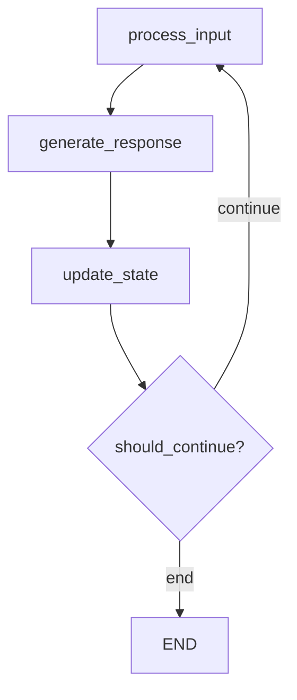

# Architecture Overview

Bob LangGraph Agent is built with a modular architecture using LangGraph for workflow management and Anthropic Claude for intelligent responses.

## High-Level Architecture

```
┌─────────────────┐    ┌─────────────────┐    ┌─────────────────┐
│   User Input    │───▶│   Bob Agent     │───▶│   Claude LLM    │
└─────────────────┘    └─────────────────┘    └─────────────────┘
                               │
                               ▼
┌─────────────────┐    ┌─────────────────┐    ┌─────────────────┐
│   Response      │◀───│   LangGraph     │───▶│  State Manager  │
└─────────────────┘    │   Workflow      │    └─────────────────┘
                       └─────────────────┘
                               │
                               ▼
                       ┌─────────────────┐
                       │  Memory Saver   │
                       │ (Conversation)  │
                       └─────────────────┘
```

## Core Components

### 1. BobAgent (`agent.py`)

The main orchestrator that:
- Manages the LangGraph workflow
- Coordinates between components
- Handles conversation threading
- Provides user-facing API

**Key Methods:**
- `chat()` - Synchronous conversation
- `stream_chat()` - Streaming responses
- `get_conversation_history()` - Retrieve history

### 2. BobConfig (`config.py`)

Configuration management system that:
- Loads settings from environment variables
- Provides sensible defaults
- Validates required parameters
- Supports programmatic configuration

**Configuration Sources:**
1. Environment variables
2. Direct instantiation
3. `.env` file (via python-dotenv)

### 3. AgentState (`state.py`)

State management using TypedDict that tracks:
- **Messages**: Conversation history
- **User Input**: Current user message
- **Agent Response**: Generated response
- **Iteration Count**: Loop prevention
- **Should End**: Conversation termination
- **Context**: Additional metadata

### 4. LangGraph Workflow

The core workflow consists of three main nodes:



#### Node Functions:

1. **process_input**: 
   - Converts user input to HumanMessage
   - Updates message history
   - Increments iteration counter

2. **generate_response**:
   - Prepares conversation context
   - Calls Claude API
   - Returns generated response

3. **update_state**:
   - Adds AI response to history
   - Clears user input for next iteration
   - Manages state transitions

4. **should_continue** (conditional):
   - Checks iteration limits
   - Validates end conditions
   - Controls workflow flow

## Data Flow

### 1. Message Processing
```
User Input → HumanMessage → Messages List → Claude API
```

### 2. Response Generation
```
Messages List → Claude Context → API Call → AIMessage → Response
```

### 3. State Updates
```
Response → AIMessage → Updated Messages → State Persistence
```

## Memory Management

### Conversation Persistence
- **MemorySaver**: LangGraph's built-in memory system
- **Thread-based**: Separate conversations by thread_id
- **State Checkpoints**: Automatic state saving between steps

### Memory Structure
```python
{
    "thread_id": {
        "messages": [HumanMessage, AIMessage, ...],
        "state": AgentState,
        "checkpoint": workflow_position
    }
}
```

## Error Handling

### Configuration Errors
- Missing API keys
- Invalid model parameters
- Environment variable issues

### Runtime Errors
- API rate limits
- Network connectivity
- Model response errors

### Workflow Errors
- Infinite loop prevention
- State corruption recovery
- Graceful degradation

## Extensibility Points

### 1. Custom Nodes
Add new workflow nodes for specialized functionality:
```python
workflow.add_node("custom_processing", custom_function)
```

### 2. State Extensions
Extend AgentState for additional context:
```python
class ExtendedState(AgentState):
    custom_field: str
    additional_context: dict
```

### 3. LLM Swapping
Replace Claude with other models:
```python
from langchain_openai import ChatOpenAI
self.llm = ChatOpenAI(model="gpt-4")
```

### 4. Custom Memory
Implement alternative persistence:
```python
from langgraph.checkpoint.postgres import PostgresSaver
memory = PostgresSaver(connection_string)
```

## Design Principles

### 1. **Separation of Concerns**
- Configuration isolated in BobConfig
- State management in separate module
- LLM interaction abstracted

### 2. **Composability**
- Modular workflow design
- Pluggable components
- Easy extension points

### 3. **Type Safety**
- TypedDict for state management
- Type hints throughout
- Runtime validation

### 4. **Error Resilience**
- Graceful error handling
- Iteration limits
- State recovery

## Performance Considerations

### Memory Usage
- Conversation history grows over time
- Consider implementing history truncation
- Monitor memory usage in long conversations

### API Efficiency
- Batch processing where possible
- Optimize prompt construction
- Cache frequent requests

### Concurrency
- Thread-safe design
- Multiple conversation support
- Async-ready architecture

This architecture provides a solid foundation for building conversational AI agents while maintaining flexibility for future enhancements.